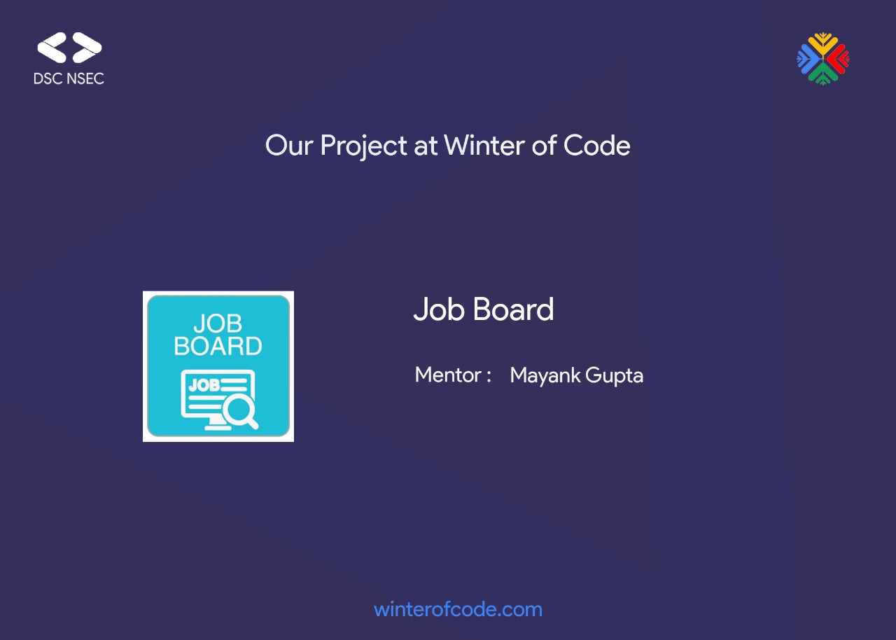

# Hope Foundation Job Portal
Hope Foundation is an NGO, which gives skills training, mostly to orphanage people, where skills like Carpentry, Security, Typist, Painting, etc. To help them to get jobs.  
We have to make a web portal, where user can post their requirements, and workers can make have their own profile. So, this portal helps the user to get a perfect job, by showing correct matches relevant to their skills, which works on randomness matches or based on average number of job that a worker have, We also need to care, that everyone should get an opportunity to get a job, this will not be like one person is getting 4 jobs, and another one is not getting a single one.

## Some features of this portal - 
Sign Up and Log In Page  
Profile page of workers  
A Job-view board in which user can post their jobs, in which any workers can apply.  
A Job matcher board, in which user can view the perfect matched workers, according to skills.  

## Contribution
Anyone who wants to contribute in this repo, Join this slack channel - http://dscnsec.slack.com/#job-board, and drop a message which will contain your introduction and what are you going to contribute in this repo.

## Techstack
Framework - Python Django  
Database - PostgreSQL
### Mentors: 

| Name | Github |
| -- | -- |
| Mayank Gupta | [mayankgbrc](https://github.com/mayankgbrc) |
